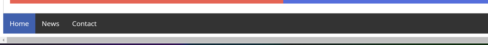
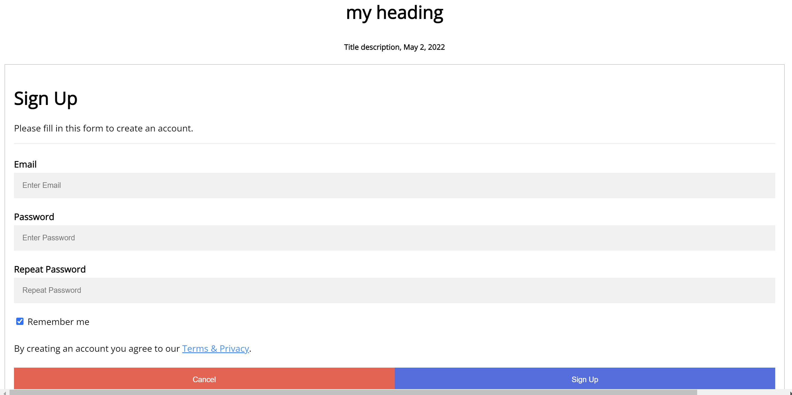

# JSX Exercise

- You have given an html and css files with the respective code . You have to replicate the same in Reactjs now in components .
- Do take care of all the js conversion to convert the code into jsx.

### Component 1

### Component 2

### Component 3

