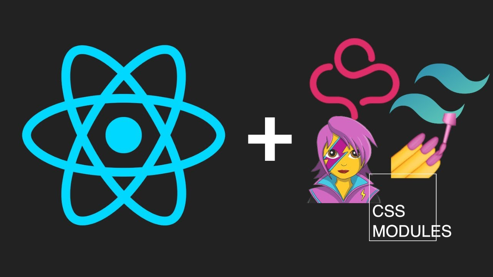

<div align="center">
  <h1> 30 Days Of React: Getting Started React</h1>
  <!-- <a class="header-badge" target="_blank" href="/"> -->
  <!--  -->
  </a>
  <a class="header-badge" target="_blank" href="">
  <!--  -->
  </a>

</div>


- [Different ways to style your react app](#different-ways-to-style-your-react-app)

  - [1. Inline Styles](#1-inline-styles)
  - [2. Plain CSS](#2-plain-css)
  - [Sass Scss](#sass-scss)
  - [CSS Modules](#css-modules)
  - [CSS in JS](#css-in-js)

    - [Key Takeaways](#key-takeaways)
    - [Exercises](#exercises)

# Different ways to style your react app

I have broken down the 5 primary ways you have to choose between when writing CSS in your React app.

There is no #1 way to approach to writing styles in React for every project. Every project is different and has different needs.

That's why at the end of each section, I will cover the pros and cons of each approach to help you choose which is the best for you in your projects.
Let's get started!



# 1. Inline Styles

Inline styles are the most direct away to style any React application.

Styling elements inline doesn't require you to create a separate stylesheet.

Style applied directly to the elements as compared to styles in a stylesheet also have higher precedence. This means that they "override" other style rules that may be applied to an element.

Here is our testimonial card styled with inline styles:

```html
export default function App() {
  return (
    <section
      style={{
        fontFamily: '-apple-system',
        fontSize: "1rem",
        fontWeight: 1.5,
        lineHeight: 1.5,
        color: "#292b2c",
        backgroundColor: "#fff",
        padding: "0 2em"
      }}
    >
      <div
        style={{
          textAlign: "center",
          maxWidth: "950px",
          margin: "0 auto",
          border: "1px solid #e6e6e6",
          padding: "40px 25px",
          marginTop: "50px"
        }}
      >
        
        <div>
          <p
            style={{
              lineHeight: 1.5,
              fontWeight: 300,
              marginBottom: "25px",
              fontSize: "1.375rem"
            }}
          >
            This is one of the best developer blogs on the planet! I read it daily to improve my skills.
          </p>
        </div>
        <p
          style={{
            marginBottom: "0",
            fontWeight: 600,
            fontSize: "1rem"
          }}
        >
          Tammy Stevens
          <span style={{ fontWeight: 400 }}> · Front End Developer</span>
        </p>
      </div>
    </section>
  );
}
```

Despite a few quick benefits, inline styles are only an acceptable choice for very small applications. The difficulties with inline styles become apparent as your code base grows even slightly.

As the code example above shows, even a small component like this becomes very bulky if all the styles are inline.

One quick trick however is to put inline styles into reusable variables, which can be stored in a separate file:

```html
const styles = { section: { fontFamily: "-apple-system", fontSize: "1rem",
fontWeight: 1.5, lineHeight: 1.5, color: "#292b2c", backgroundColor: "#fff",
padding: "0 2em" }, wrapper: { textAlign: "center", maxWidth: "950px", margin:
"0 auto", border: "1px solid #e6e6e6", padding: "40px 25px", marginTop: "50px"
}, avatar: { margin: "-90px auto 30px", width: "100px", borderRadius: "50%",
objectFit: "cover", marginBottom: "0" }, quote: { lineHeight: 1.5, fontWeight:
300, marginBottom: "25px", fontSize: "1.375rem" }, name: { marginBottom: "0",
fontWeight: 600, fontSize: "1rem" }, position: { fontWeight: 400 } }; export
default function App() { return (
<section style="{styles.section}">
  <div style="{styles.wrapper}">
    
    <div>
      <p style="{styles.quote}">
        This is one of the best developer blogs on the planet! I read it daily
        to improve my skills.
      </p>
    </div>
    <p style="{styles.name}">
      Tammy Stevens
      <span style="{styles.position}"> · Front End Developer</span>
    </p>
  </div>
</section>
); }
```

Despite this improvement, inline styles do not have a number of essential features that any simple CSS stylesheet could provide.

For example, you cannot write animations, styles for nested elements (i.e. all child elements, first-child, last-child), pseudo-classes (i.e. :hover), and pseudo-elements (::first-line) to name a few.

If you're prototyping an application, inline styles are great. However, as you get further into making it, you will need to switch to another CSS styling option to give you basic CSS features.

## Now lets discuss the pros and cons of inline css

## Pros :

1. Quickest way to write styles
2. Good for prototyping (write inline styles then move to stylesheet)
3. Has great preference (can override styles from a stylesheet)

## Cons :

1. Tedious to convert plain CSS to inline styles
2. Lots of inline styles make JSX unreadable
3. You can not use basic CSS features like animations, selectors, etc.
4. Does not scale well

## Now as you have a good idea about inline Css , Let's do a quick exercise :

## try to make a component which could look similar to this :

### Feel free to use any external libraries or custom objects


# 2. Plain CSS

Instead of using inline styles, it's common to import a CSS stylesheet to style a component's elements.

Writing CSS in a stylesheet is probably the most common and basic approach to styling a React application, but it shouldn't be dismissed so easily.

Writing styles in "plain" CSS stylesheets is getting better all the time, due to an increasing set of features available in the CSS standard.

This includes features like CSS variables to store dynamic values, all manner of advanced selectors to select child elements with precision, and new pseudo-classes like :is and :where.

Here is our testimonial card written in plain CSS and imported at the top of our React application:

```css
/* src/styles.css */

body {
  font-family: -apple-system, system-ui, BlinkMacSystemFont, "Segoe UI", Roboto,
    "Helvetica Neue", Arial, sans-serif;
  margin: 0;
  font-size: 1rem;
  font-weight: 1.5;
  line-height: 1.5;
  color: #292b2c;
  background-color: #fff;
}
.testimonial {
  margin: 0 auto;
  padding: 0 2em;
}
.testimonial-wrapper {
  text-align: center;
  max-width: 950px;
  margin: 0 auto;
  border: 1px solid #e6e6e6;
  padding: 40px 25px;
  margin-top: 50px;
}
.testimonial-quote p {
  line-height: 1.5;
  font-weight: 300;
  margin-bottom: 25px;
  font-size: 1.375rem;
}
.testimonial-avatar {
  margin: -90px auto 30px;
  width: 100px;
  border-radius: 50%;
  object-fit: cover;
  margin-bottom: 0;
}
.testimonial-name {
  margin-bottom: 0;
  font-weight: 600;
  font-size: 1rem;
}
.testimonial-name span {
  font-weight: 400;
}
```

```jsx
// src/App.js

import "./styles.css";

export default function App() {
  return (
    <section className="testimonial">
      <div className="testimonial-wrapper">
        
        <div className="testimonial-quote">
          <p>
            This is one of the best developer blogs on the planet! I read it
            daily to improve my skills.
          </p>
        </div>
        <p className="testimonial-name">
          Tammy Stevens<span> · Front End Developer</span>
        </p>
      </div>
    </section>
  );
}
```

For our testimonial card, note that we are creating classes to be applied to each individual element. These classes all start with the same name testimonial-.

CSS written in a stylesheet is a great first choice for your application. Unlike inline styles, it can style your application in virtually any way you need.

One minor problem might be your naming convention. Once you have a very well-developed application, it becomes harder to think of unique classnames for your elements, especially when you have 5 divs wrapped inside each other.

If you don't have a naming convention you are confident with (i.e. BEM), it can be easy to make mistakes, plus create multiple classes with the same name, which leads to conflicts.

Additionally, writing normal CSS can be more verbose and repetitive than newer tools like SASS/SCSS. As a result, it can take a bit longer to write your styles in CSS versus a tool like SCSS or a CSS-in-JS library.

Plus, it's important to note that since CSS cascades to all children elements, if you apply a CSS stylesheet to a component it is not just scoped to that component. All its declared rules will be transferred to any elements that are children of your styled component.

If you are confident with CSS, it is definitely a viable choice for you to style any React application.

With that being said, there are a number of CSS libraries that give us all the power of CSS with less code and include many additional features that CSS will never have on its own (such as scoped styles and automatic vendor prefixing).

## Now lets discuss the pros and cons of plain css

## Pros :

1. Easy to write
2. Easy to understand
3. Gives us all of the tools of modern CSS (variables, advanced selectors, new pseudo-classes, etc.)
4. Helps us clean up our component files from inline styles

## Cons :

1. Can be verbose and repetitive
2. Can be hard to think of unique classnames
3. Need to setup vendor prefixing to ensure latest features work for all users
4. Requires more typing and boilerplate than other CSS libraries (i.e. SASS)
5. Any stylesheet cascades to component and all children; not scoped
6. Must use a reliable naming convention to ensure styles don't conflict

## Key Takeaways

Note that I did not include component libraries in this comparison. I wanted to focus primarily on different ways to compose styles yourself.

Be aware that choosing a library with pre-made components and styles like Material UI or Ant Design (to name a couple) is a totally valid choice for your project.

I hope this guide gave you a good understanding of how to style your React apps along with which approach to choose for your next project.

# Exercises

## Try to implement the above mentioned styling methods in your next react project and see which one suits you the best.

🎉 CONGRATULATIONS ! 🎉

# Here are some of the extra resources which you can go through :

# Sass Scss


What is SASS? SASS is an acronym that stands for: Syntactically Awesome Style Sheets.

SASS gives us some powerful tools, many of which don't exist in normal CSS stylesheets. It includes features like variables, extending styles, and nesting.

SASS allows us to write styles in two different kinds of stylesheets, with the extensions .scss and .sass.

SCSS styles are written in a similar syntax to normal CSS, however SASS styles do not require us to use open and closing brackets when writing style rules.

Here is a quick example of an SCSS stylesheet with some nested styles:

```css
/* styles.scss */

nav {
  ul {
    margin: 0;
    padding: 0;
    list-style: none;
  }

  li {
    display: inline-block;
  }

  a {
    display: block;
    padding: 6px 12px;
    text-decoration: none;
  }
}
```

Compare this with the same code written in a SASS stylesheet:

```css
/* styles.sass */

nav
  ul
    margin: 0
    padding: 0
    list-style: none

  li
    display: inline-block

  a
    display: block
    padding: 6px 12px
    text-decoration: none
```

Since this is not regular CSS, it needs to be compiled from SASS into plain CSS. To do so in our React projects, you can use a library like node-sass.

If you are using a Create React App project, to start using .scss and .sass files, you can install node-sass with npm:

## npm install node-sass

Here is our testimonial card styled with SCSS:

```css
/* src/styles.scss */

$font-stack: -apple-system, system-ui, BlinkMacSystemFont, "Segoe UI", Roboto,
  "Helvetica Neue", Arial, sans-serif;
$text-color: #292b2c;

%font-basic {
  font-size: 1rem;
}

body {
  @extend %font-basic;
  font-family: $font-stack;
  color: $text-color;
  margin: 0;
  font-size: 1rem;
  font-weight: 1.5;
  line-height: 1.5;
  background-color: #fff;
}

/* unchanged rules skipped */

.testimonial-name {
  @extend %font-basic;
  margin-bottom: 0;
  font-weight: 600;

  span {
    font-weight: 400;
  }
}
```

These styles give us the following features: variables, extending styles and nested styles.

Variables: You can use dynamic values by writing variables, just like in JavaScript, by declaring them with a $ at the beginning.

There are two variables that can be used in multiple rules: $font-stack, $text-color.

Extending / Inheritance: You can add onto style rules by extending them. To extend rules, you create your own selector which can be reused like a variable. The name of rules that you want to extend start with %.

The variable %font-basic is inherited by the rules body and .testimonial-name.

Nesting: Instead of writing multiple rules that begin with the same selector, you can nest them.

In .testimonial-name , we use a nested selector to target the span element within it.

## Now lets discuss the pros and cons of sass scss

## Pros :

1. Includes many dynamic CSS features like extending, nesting, and mixins
2. CSS styles can be written with much less boilerplate over plain CSS

## Cons :

1. Easy to write
2. Like plain CSS, styles are global and not scoped to any one component
3. CSS stylesheets is starting to include a number of features that SASS had exclusively, such as CSS variables (not necessarily a con, but worth noting)
4. SASS / SCSS often requires setup, such as installing the Node library node-sass.

# CSS Modules

CSS Modules is a library that allows us to write CSS stylesheets that are scoped to a single component.
CSS modules are another slight alternative to something like CSS or SASS.

What is great about CSS modules is that they can be used with either normal CSS or SASS. Plus, if you are using Create React App you can start using CSS modules with no setup at all.

Here is our application written with CSS modules:

```css
/* src/styles.module.css */

body {
  font-family: -apple-system, system-ui, BlinkMacSystemFont, "Segoe UI", Roboto,
    "Helvetica Neue", Arial, sans-serif;
  margin: 0;
  font-size: 1rem;
  font-weight: 1.5;
  line-height: 1.5;
  color: #292b2c;
  background-color: #fff;
}

/* styles skipped */

.testimonial-name span {
  font-weight: 400;
}
```

```js
import styles from "./styles.module.css";

export default function App() {
  return (
    <section className={styles.testimonial}>
      <div className={styles["testimonial-wrapper"]}>
        
        <div>
          <p className={styles["testimonial-quote"]}>
            This is one of the best developer blogs on the planet! I read it
            daily to improve my skills.
          </p>
        </div>
        <p className={styles["testimonial-name"]}>
          Tammy Stevens
          <span> · Front End Developer</span>
        </p>
      </div>
    </section>
  );
}
```

Our CSS file has the name .module in it before the extension .css. Any CSS module file must have the name "module" in it and end in the appropriate extension (if we are using CSS or SASS/SCSS).

What is interesting to note if we look at the code above is that CSS modules are written just like normal CSS, but are imported and used as if it were created as objects (inline styles).

The benefit of CSS modules is that it helps avoid our problem of class conflicts with normal CSS. The properties that we are referencing turn into unique classnames that cannot conflict with one another when our project is built.

Our generated HTML elements will look like this:

```html
<p class="_styles__testimonial-name_309571057">Tammy Stevens</p>
```

Plus, CSS modules solve the problem of global scope in CSS. As compared to our normal CSS stylesheets, CSS declared using modules to individual components will not cascade to child components.

Therefore, CSS modules are best to use over CSS and SASS to make sure classes don't conflict and to write predictable styles that only apply to one or another component.

## Now lets discuss the pros and cons of css modules

## Pros :

1. Styles are scoped to one or another component (unlike CSS / SASS)
2. Unique, generated classnames ensure no style conflict
3. Can use them immediately without setup in CRA projects
4. Can be used with SASS / CSS

## Cons :

1. Can be tricky to reference classnames
2. May be a learning curve to use CSS styles like object properties

# CSS in JS

Similar to how React allowed us to write HTML as JavaScript with JSX, CSS-in-JS has done something similar with CSS.

CSS-in-JS allows us to write CSS styles directly in our components' javascript (.js) files.

Not only does it allow you write CSS style rules without having to make a single .css file, but these styles are scoped to individual components.

In other words, you can add, change or remove CSS without any surprises. Changing one component's styles will not impact the styles of the rest of your application.

CSS-in-JS often makes use of a special type of JavaScript function called a tagged template literal. What's great about this is that we can still write plain CSS style rules directly in our JS!

Here's a quick example of a popular CSS-in-JS library, Styled Components:

```js
import styled from "styled-components";

const Button = styled.button`
  color: limegreen;
  border: 2px solid limegreen;
  font-size: 1em;
  margin: 1em;
  padding: 0.25em 1em;
  border-radius: 3px;

  &:hover {
    opacity: 0.9;
  }
`;

export default function App() {
  return (
    <div>
      <Button>Click me</Button>
    </div>
  );
}
```


Note a few things here:

1. You can write normal CSS styles, but can include nested styles and pseudo-classes (like hover).
2. You can associate styles with any valid HTML element, such as the button element above (see styled.button).
3. You can create new components with these associated styles. See how Button is used in our App component.

Since this is a component, can it be passed props? Yes! We can export this component and use it anywhere in our app we like, plus give it dynamic features through props.

Let's say that you want an inverted variant of Button above with an inverted background and text. No problem.

Pass the inverted prop to our second button and in Button, you can access all props passed to the component using the ${} syntax with an inner function.

```js
import styled from "styled-components";

const Button = styled.button`
  background: ${(props) => (props.inverted ? "limegreen" : "white")};
  color: ${(props) => (props.inverted ? "white" : "limegreen")};
  border: 2px solid limegreen;
  font-size: 1em;
  margin: 1em;
  padding: 0.25em 1em;
  border-radius: 3px;

  &:hover {
    opacity: 0.9;
  }
`;

export default function App() {
  return (
    <div>
      <Button>Click me</Button>
      <Button inverted>Click me</Button>
    </div>
  );
}
```

In the return of the function, you can select the inverted prop and use a ternary to conditionally determine the color of the background and text.

Here is the result:


There are a great deal more benefits to using a CSS-in-JS library to style your React applications (too many to cover here), some of which I will list below.

Be sure to check out the two most popular CSS-in-JS libraries for React: Emotion and Styled Components.

One downside to using a CSS-in-JS libraries is adding an additional library to your project. However, I would argue this is easily worth the improved developer experience you have when styling your React apps versus plain CSS.

## Now lets discuss the pros and cons of css in js

## Pros :

1. CSS-in-JS is predictable – styles are scoped to individual components
2. Since our CSS is now JS, we can export, reuse, and even extend our styles through props
3. CSS-in-JS libraries ensure there are no styling conflicts by generating unique classnames for your written styles
4. No need to focus on naming conventions for your classes, just write styles!

## Cons :

1. CSS-in-JS libraries can be a bit tricky to learn
2. May be a learning curve to use CSS styles like object properties
3. Unlike plain CSS, you will need to install one or more third-party JavaScript libraries, which will add weight to your built project

[<< Day 3](../Day_03_Resume_builder/Day_03_Resume_builder.md) | [Day 5 >>](../Day_05_props/Day_05_props.md)
