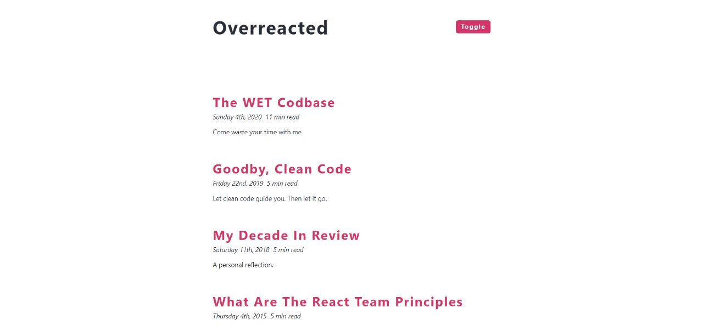
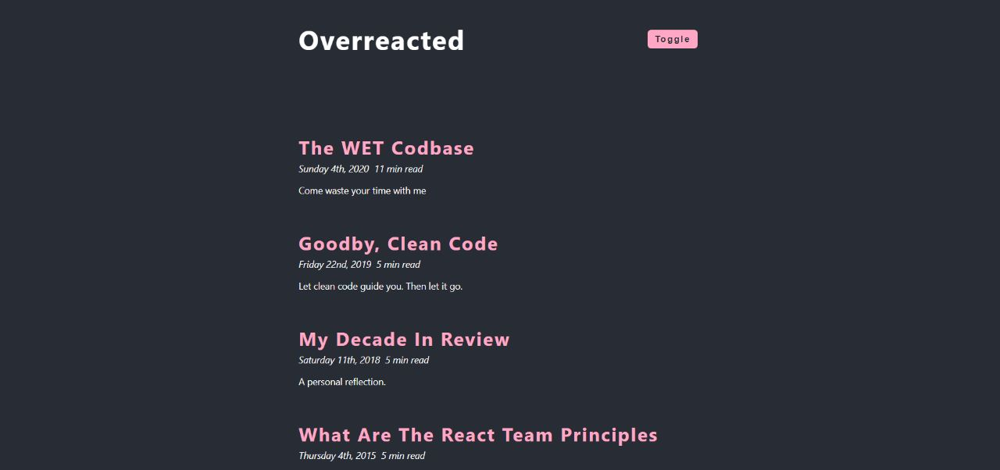

# Implement the dark mode to the following webpage given below

## This is the default mode which is initially light

## After clicking on the toggle button,the page should get re-rendered and th3 color should change to dark

