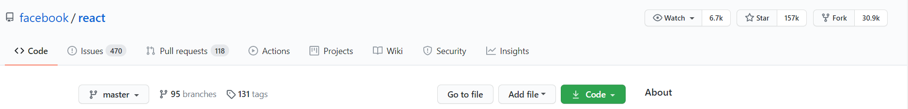
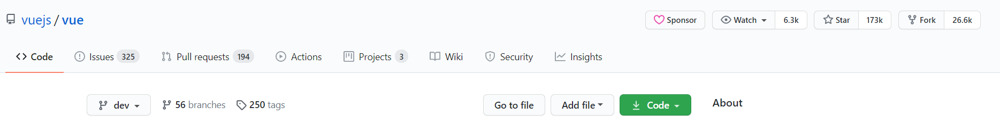
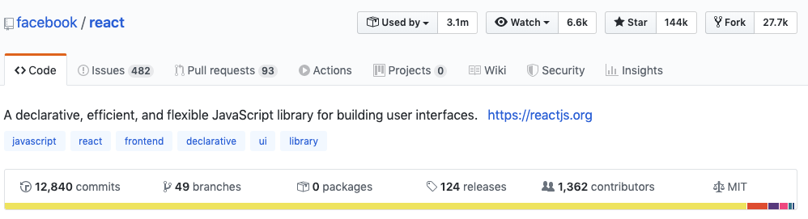

  <h1> 30 Days Of React: Getting Started React</h1>
  <!-- <a class="header-badge" target="_blank" href="/"> -->
  <!--  -->
  </a>
  <a class="header-badge" target="_blank" href="">
  <!--  -->
  </a>

<!-- Author:
<a href="/" target="_blank">Ritik Masand</a> 
<small> August, 2022</small>
 -->          

<!-- [<< Day 1](../01_Day_JavaScript_Refresher/01_javascript_refresher.md) | [Day 3 >>](../03_Day_Setting_Up/03_setting_up.md) -->

- [Is React js a good career](#is-react-js-a-good-career)
  - [1. How do I write a resume for a React js developer?](#1-how-do-i-write-a-resume-for-a-react-js-developer)
  - [2. Begin Your Resume with the Introductory Sections?](#2-begin-your-resume-with-the-introductory-sections)
    <!-- - [React vs Vue popularity in October 2020](#react-vs-vue-popularity-in-october-2020)
    - [React vs Vue popularity in February 2020](#react-vs-vue-popularity-in-february-2020) -->
  - [3. Spruce Up Your Professional Experience Section](#3-spruce-up-your-professional-experience-section)
    - [Framing Points](#framing-points)
    - [Star format](#star-format)
    - [Grouping and Highlighting](#grouping-and-highlighting)
    
    <!-- - [Injecting data to a JSX Element](#injecting-data-to-a-jsx-element)
      - [Injecting a string to a JSX Element](#injecting-a-string-to-a-jsx-element)
      - [Injecting a number to a JSX Element](#injecting-a-number-to-a-jsx-element)
      - [Injecting an array to a JSX Element](#injecting-an-array-to-a-jsx-element)
      - [Injecting an object to a JSX Element](#injecting-an-object-to-a-jsx-element) -->
  - [Key Skills Section of Your React JS Developer Resume](#key-skills-section-of-your-react-js-developer-resume
)
    - [Add a Summary/Objective of Your React JS Developer Resume](#add-a-summary-of-your-react-js-developer-resume)
    - [Add Academic Details to Demonstrate Your Theoretical Knowledge](#add-academic-details-to-demonstrate-your-theoretical-knowledge)
    - [React JS Developer Resume: Certifications](#react-js-developer-resume-certifications)
    - [Junior ReactJS Developer Resume Sample](#junior-reactjs-developer-resume-sample)
    - [Key Takeaways](#key-takeaways)

## Is React js a good career?

Did you know that an average resume does not reach a human recruiter before it is parsed by an Applicant Tracking Software?

The popularity of React.js is higher than other frameworks, making it a very promising career. Most companies have begun to invest in specific roles that require proficiency in this tool.

# IMAGE-------------------

### 1. How do I write a resume for a React js developer?
Now that you know how to approach resume writing the right way, we will now discuss the resume sections you should use to organize information in your resume for React js developer jobs.

1. Header
2. Personal Information
3. Profile Title
4. Summary/Objective
5. Key Skills
6. Professional Experience
7. Education

If you have more information to put in your React js experience resume, you can compile them under these resume sections:

1. Internships
2. Training & Certifications
3. Projects
4. Awards & Recognition
5. Volunteering Experience

To avoid the hassle of curating resume sections on your own, use Hiration's resume builder. It has an in-built React js resume template with pre-arranged sections that are positioned right where they should be.

Moreover, you can use it as the perfect reference to draft an impeccable React js experience resume that is earmarked for perfection.
### 2. Begin Your Resume with the Introductory Sections

The resume header, profile title, and personal information sections are the first three sections you should compose in your React js resume.

Begin your React js sample resume by curating these sections first.

It may not be as simple as you imagine, have a look!

# Create a React Resume Header

The resume header is the first section of your React js sample resume. Traditionally, it is the thing you write at the topmost part of your resume.
# IMAGE-------------------
If you have been using a generic 'CV' or 'Resume' as your resume header in the past, stop right away. Instead, write your real full name.

# Cover Contact Information in Your React JS Resume

The personal information section of your React js sample resume should ideally consist of three main things:

1. Functional mobile number
2. Professional Email ID
3. Current Location
4. Link to websites

## IMAGE------------------------------

# In case you're curious, here's a React js resume sample demonstrating the personal information section:
# IMAGE-------------------

# Add a Profile Title to Your React JS Developer Resume
The profile title is the third section of your React js sample resume. Here's what makes it important:

1. It communicates your current/last-held job title.
2. It communicates your functional industry or area of expertise.
3. It communicates your seniority level.
4. It communicates your potential income.
5. All this information just goes on to show that you need to correctly write your profile title in your React js sample resume.

So if you are a React JS Developer, write your profile title as it is. Example: 'React JS Developer'.

Do not oversell yourself while writing your profile title because recruiters may consider it a false advertisement for your professional status.

And while doing so, ensure that you present yourself on the level where you rightfully belong as a developer.

Additionally, we advise you to write your profile title in the second-largest font text, preferably 14-16 points.

Here's an example of a React js resume sample illustrating a correctly written profile title for a React Developer:

# IMAGE-------------------

# Highlight Key Points in Your React JS Developer Resume
 When recruiters browse through your resume, they evaluate three key sections:

1. Professional Experience
2. Key Skills
3. Summary
4. These three sections are also known as the three key sections of your resume. You need to perfect these sections to impress the recruiter.

We will now show you how to do this. Let's begin.
<!-- #### React vs Vue popularity in October 2020

React Official GitHub Repository

Vue Official GitHub Repository

 -->

<!-- #### React vs Vue popularity in February 2020 -->

<!-- React Official GitHub Repository

Vue Official GitHub Repository

Why we choose to use React ? We use it because of the following reasons:

- fast
- modular
- scalable
- flexible
- big community and popular
- open source
- High job opportunity -->

### 3. Spruce Up Your Professional Experience Section

The professional experience section is the heart and soul of your React js developer resume.

This is where you include work-centric information such as the places you have worked, the job titles you have held, the duration of your work, and the nature of your work.

All this put together helps you show your skill levels and expertise. These go on to decide if you be able to thrive in a new organization and if you will be able to execute the roles assigned to you.

As such, this section is incredibly important.

To make an impact on the recruiter, you have to perfect this section at all costs. Here are three ways you can achieve this:

1. Frame one-liner points, not paragraphs
2. Use the STAR format to optimize each point
3. Use grouping & highlighting to enhance the overall effectiveness

#### Framing Points

Framing points simply means using one-liner points to communicate the details of your work experience. Here's why you should use it:

1. Paragraphs make your resume look bulky and cluttered. It also makes your content hard to read and harder to comprehend.
2. On the contrary, using one-liner points is considered a better alternative to using paragraphs. It is reader-friendly and helps you communicate information effectively.
3. A recruiter will not read your resume in totality if it is not reader-friendly.
4 .Moreover, using one-liner points also makes it easier for an ATS to parse your resume as it can be easily read & interpreted by the recruitment software.

#### STAR Format

Now that you know how to enhance the readability of this section, we will teach you how to optimize each one-liner point to make your resume worth reading.

Giving a bland statement of your everyday roles & responsibilities will not help you strike gold with the recruiter. To impress him/her, you need to do more.

This is where the STAR format comes in.

This is what it stands for:

1. Situation: The situation/backdrop/context of your contributions
2. Task: The actual task that was assigned to you
3. Action: The strategy you used to execute the assigned task
4. Result: The result/outcome of your action in the form of an achievement figure

Instead of formulating your statements in this manner:

1. Debugged codes & improved software

Rephrase it and present it in your resume in the following way:
 
2. Debugged application codes and improved interface software to improve functionality and performance by 50%

#### Grouping and Highlighting

Next comes grouping & highlighting.

1. Simply put, it means grouping similar one-liner points and grouping them under unique titles or groups.

2. Doing this communicates your key responsibility & expertise areas to the recruiter in one glance.

3. Highlighting means to bold relevant words/phrases by marking them stand out.

4. Highlighting words or achievement figures can easily draw the recruiter's attention to them as they stand out when they're marked in bold.

The feisty combination of grouping & highlighting thus helps you present information more effectively. It makes your otherwise long resume seem more legible and palatable.

Always remember that you need to introduce yourself as the best applicant for the targeted job profile through your resume to the recruiters.

Here's a React js resume example showcasing a perfectly composed professional experience section:

### Key Skills Section of Your React JS Developer Resume

The key skills section is the second key section of your React js developer resume. Just like the professional experience section, this too needs to be perfect at all costs.

By creating a separate section for your react JS developer skills you make it easier for recruiters to identify your potential.

Here are some of the key skills that a recruiter looks for in a React js resume points:

# IMAGE-------------------

#### Some of the technical skills that you should include in your React js resume points:

It is important because your React JD skills make you the professional that you are. It is inevitably one of the first things that a recruiter looks for in your resume.

Why? Because a recruiter wants to know if you meet the skill criteria mentioned in the JD for that particular job vacancy.

Thus, it is your job to make it easier for a recruiter to locate your React js skills in your resume. If they are not able to locate it in one go, they might lose interest in further evaluating your resume. Trust us, you do not want that.

Here's a React js resume example showcasing the perfect key skills section for your React js developer resume:

# IMAGE-------------------

#### add a summary of your react js developer resume

Should you write a React js resume professional summary or an objective?

Let's find out:

1. 1If you have 3 years of relevant work experience, write a React js resume professional summary.
2. If you have zero to less than three years of relevant work experience, write an objective statement.
Whether you're writing a React js resume professional summary or objective, you need to perfect it at all costs. Given the fact that it gives an overview of your career trajectory, you need to make it crisp and effective.

You need to convey that you are the best fit for the job through the React js resume professional summary or objective. Here are some tips that you can implement:

1. Compose the React js resume professional summary or objective at the end.
2. This helps you scan through your resume and work experience in one go which means that it makes it easy to pick your career highlights easily.
3. Moreover, taking this approach also minimizes the scope of repeated correction. Since you have all the data with you, your only job here is to pick relevant points and present them effectively.
4. Since the React js resume professional summary or objective is more like an expertise statement, keep it short. We advise you to stick to a 3-5 lines paragraph summary or objective.

Attached below is a React js resume example showcasing a perfectly written React js resume professional summary:
# IMAGE-------------------

#### Add Academic Details to Demonstrate Your Theoretical Knowledge

Like it or not, learning begins in school. And what nobody tells you is this:

No matter how old you grow, or how many places you have worked for; your educational background & qualifications will always stay relevant. You will be expected to present your academic information in your React JS developer resume.

So make an 'education' section in your resume and fill it with the following details:

1. Your school/university name.
2. Dates of enrollment & graduation.
3. Name of the courses you have pursued.
4. The location of your school/university.
5. Here's a React js resume example showcasing a perfectly composed education section:

Here's a React js resume example showcasing a perfectly composed education section:

# IMAGE-------------------

#### React JS Developer Resume Certifications

In addition to the education section, you can also include the certifications section to present any relevant certifications or online courses you may have done.

1. Adding the certification section helps you with your job application as it shows a recruiter that your learning curve is as active as ever.
2. It also shows that you are up-skilled and on the right path to evolving with the latest industry trends.

If you don't have any relevant certifications, we advise you to sign up for an online course that is relevant to your niche/industry. Once you do this, present the details of this certification or online course in your resume in the following manner:

1. Name of the certification or online course.
2. Name and location of the certifying body/institute.
3. Dates of enrollment and completion of the certification.

Here's a React js resume example demonstrating the ideal certifications section for your resume:

# IMAGE-------------------

#### Junior ReactJS Developer Resume Sample

# IMAGE-------------------

#### Key Takeaways

Here are the key takeaways of our React JS developer resume 2022 guide:

1. Writing a perfect React js roles and responsibilities sample resume is not enough. You need to optimize for ATS compliance too.
2. To improve your resume's chances of getting parsed by the ATS software,** enhance** its readability, optimize your resume with relevant keywords, and pick a clean design template.
3. Identify the keywords from the JD and incorporate them organically in your resume as long as they match your skills & professional expertise.
4. Double-check your contact details. It should be accurate and free of spelling errors as they are the only medium for official communication.
5. You need to perfect the professional experience section at all costs.
6. To do this, use power verbs to begin your React js resume points. This adds a tone of professionalism to the way you present your work details.
7. Use numbers/figures to quantify your achievements in this section.
8. Write a perfect React js resume professional summary advocating your suitability for the job. The best way to do this is by presenting your achievements.
